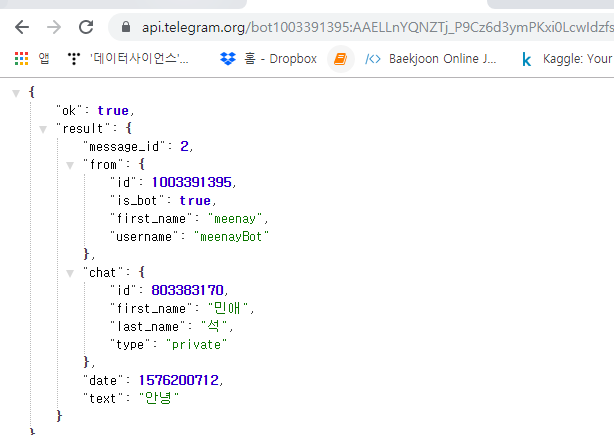

# 파이썬 챗봇 만들기

## 1. 개발환경 세팅

### 1.1 프로젝트 폴더 및 .gitignore 생성

* **새로운 repository 생성을 위해 폴더 생성.**

  ```html
  telegram-bot/
  	.gitignore
  ```

* 내부에서 visual studio code실행

* **.gitignore 파일 생성**
  
* gitignore.io에서 Visual Studio Code, Python, Flask,venv 를 선택해 생성하여 `.gitignore`파일에 붙여넣기
  
* **git 생성**

  ```bash
  $ git init
  $ git add .
  $ git commit -m 'generate git\'
  ```


### 1.2 가상환경 생성

* **가상환경 생성**

  ```bash
  telegram_bot/
  
  $ python -m venv venv
  ```

* **가상환경 진입**

  ```bash
  $source venv/Scripts/activate
  ```

* **VSCode 자동 가상환경 진입 설정**

  >  이 옵션을 설정하는 경우, 반드시 .vscode 폴더가 있는 디렉토리에서 open with code 혹은 open folder로 진입을 해야 터미널을 새로 켤 때 자동으로 가상환경 진입이 된다. 
>
  > 자동으로 가상환경이 켜지지 않으면 당황하지 않고 source-activate 명령어를 직접 쳐서 가상환경에 진입하자.

  * **`ctl+shift+p`-> `python: select interpreter` -> 사용할 환경 선택(`python 3.8.0 32-bit (venv)`)**

    

  * 자동설정의 결과는 다음과 같이나타난다. .vscode 폴더가 생성된다.


### 1.3  Flask 개발용 서버 실행

#### 1.3.1 Flask 설치 

* app.py 생성

* flask 설치

  반드시 가상환경 진입 여부를 확인하고 설치하자, 명령어 최상단의 (venv)

  ```bash
  #(venv)가 활성화 되었는지 확인한 상태에서
  (venv)
  $ pip install flask
  $ pip list    # flask가 있는지 확인
  ```


#### 1.3.2 Flask 공식문서로 시작하기

* **flask 공식문서에서 quickstart 코드 가져와서 app.py에 붙이기**

  ```python
  from flask import Flask
  app = Flask(__name__)
  
  @app.route('/')
  def hello_world():
      return 'Hello World!'
  
  if __name__ == '__main__':
      app.run()
  ```


#### 1.3.3 서버실행을 간편하게 

* flask실행은 flask run을 입력해야하는데, 반복입력을 없애기 위해 하단의 코드를 수정해준다.

  * 이 코드는 반드시 app.py의 가장 하단에 위치해야 한다

  ```python
  
  if __name__ == '__main__':
      app.run(debut = True)
  ```

* 이제 app실행을 위해서는 `python app.py` 또는 재생버튼을 누르면 된다

  ```bash
  (venv)
  ./telegram_bot
  $ python app.py
  ```


### 1.4 원격 저장소 생성 및 연결

* git hub에 chatbot용 repository 생성 

* **원격 저장소  연결**

  ```bash
  C:/telegram_chatbot
  $ git init
  $ git remote add origin https://github.com/...(자신의 repository 주소)
  $ git push -u origin master 
  $ git add .
  $ git commit - m 'environmental setting'
  $ git push origin master
  ```


## 2. Telegram 봇 생성 및 요청 보내보기

### 2.0 텔레그램 설치

### 2.1  봇 만들기

* BotFather -> newbot -> name 입력 -> username 입력
* 토큰 값 임시 저장하기 (-> 메모장)


### 2.2 요청 보내보기

* **요청**

  `get me` 메서드를 사용해서 내 봇에 대한 정보를 받아온다.

  ```html
  https://api.telegram.org/bot<토큰>/getMe
  ```

* 결과값

  ```json
  {
      "ok": true,
      "result": {
      "id": 1003391395,
      "is_bot": true,
      "first_name": "meenay",
      "username": "meenayBot"
      }
  }
  ```


## 3. 사용자에게 메세지 보내기

### 3.1 사용자의 ID값 알아내기

> 사용자에게 메세지를 보내려면 사용자의 고유한 ID 값을 알아야 한다. 

* `Update ` 매서드를 활용한다
  * 대화내용이 없는 상태에서 사용하면,  **result가 빈 리스트로`[] ` 나타난다.**
  * 내 봇이 메세지를 하나라도 받은 상태에서 사용하면 다음과 같이 ID를 확인할 수 있다.


### 3.2 사용자에게 답장 보내기

#### 3.2.1 URL을 이용해 답장 보내기

* `sendMessage` 매서드를 활용한다
* sendMessage 매서드는 `(1)누구에게 보낼지` , `(2) 보낼메세지 내용` 이 있어야 한다.
  * 대상과 내용이 빠지면 다음과 같은 결과가 나타난다
  	```bash
https://api.telegram.org/bot1003391395:AAELLnYQNZTj_P9Cz6d3ymPKxi0LcwIdzfs/sendMessage
		```


* 대상은 `chat_id=` ,  내용은 `text=`로 추가한다
  * 결과는 다음과 같다
	  ```bash
		https://api.telegram.org/bot<토큰>/sendMessage?chat_id=803383170&text=안녕
		```
```
		

		


#### 3.2.2 Python 코드를 이용해 사용자에게 답장 보내기

* 요청과 전송을 위해 requests 모듈이 필요하다

​```bash
pip install requests
```


#### 3.2.3 **타인의 챗에 답장보내기**

> 타인의 채팅에 답장을 보내기 위해서는 getRequest method에서  ID를 추출할 수 있어야 한다.
>
> request의 결과값이 dictionary 구조이므로,  dictionary 구조 활용에 대한 연습이 필요하다.

* <u>dictionary 구조 연습</u>

```python
# dictionary 구조 연습
artist = {
    [
        "아티스트": {
            "아이유": "블루밍",
            "민수": "민수는 혼란스럽다"
        }
    ]
}

# 민수의 대표곡은 ?
# 첫번째 방법 
print(artists["아티스트"];["민수"])

# 두번째 방법
print(artists.get("아티스트").get("민수"))

```


## 3.2.4. 환경변수 생성

> 자신의 token이 github에 공개되는 것을 방지하기 위해 개인정보와 관련된 내용들 ( ID, token) 환경변수를 생성하여 관리하자 


* 아래의 명령어로 프로젝트에 필요한 환경변수 툴을 설치한다

```bash
 $ pip install python-decouple 
```

*  app.py와 같은 루트에 .env파일을 생성한다
* .gitignore의 설정 때문에 .env 파일은 github에 올라가지 않는다. 따라서 보안이 가능하다
* .env 내에 환경변수 만들기 (토큰, 아이디)
* 이 때 띄어쓰기와 ' '조심 할 것


## 4. Flask로 메세지 보내기!

1. 플라스크로 ID,   ,  , 가져와 붙이기
2. request_html 모듈 가져오기 
3. requirements 폴더생성
4. requiirements안에 html생성하기


## 5. Web hook을 이용해 메세지 업데이트 받기

>  단순 요청 응답 구조에서는 매크로를 이용해 계속 getUpdates를 해야하는 문제가 있다. 이를 보완해 web hook을 사용할 수 있다. 
>
>  Web hook이란? A 서버 갈고리를 걸어놓으면, 나와 관련된 업데이트가 있을 때 마다 A 서버가 업데이트 사실을 전송해주는 시스템이다. 텔레그램에 Webhook을 걸어서, telegram server가 메세지를 받을 때 마다 내 flask로 자동으로 알리도록 해보자.


### 5.1 Webhook을 위한 flask 작성

#### 5.1.1 코드

```python
@app.route(f'/{token}', methods=['POST'])
def telegram():
    return '', 200
```

#### 5.1.2 POST 개념

> 요청의 종류에는 get과 post가 있다.

* 요청의 종류
  * get : html 페이지 등의 정보를 주세요
  * Post: 당신측의 정보를 생성/수정 해주세요

* 여기서 왜 get이 아닌 Post 를 사용할까?  
  * POST를 사용하는 이유는, telegram 측이 web hook을 할 때 POST형태로 보내주도록 setting이 되어 있기 때문이다. 

#### 5.1.3 {token} 과 return'', 200 이란?

> 위에서 작성한 코드는 텔레그램이 메세지 업데이트를 알려주었을 때, 텔레그램에게 결과값으로 반환할 내용을 보내는 코드임을 기억하자.

* `token`: 타인에게는 공개하지 않는 token정보를 텔레그램 측에 알려주어, telegram만 알림을 전달하게 만들 수 있다.
  * 이를 통해 token은 web hook을 구현하기 위한 요소 중 하나임을 알 수 있다.
* `return'' , 200`  
  * 텔레그램이 알림을 보내주면, 응답하는 구조인데 응답의 내용은 없으므로 '' 처리
  * 전달을 잘 받은 경우 코드 200을 보내 알려준다


## 5.2 ngrok

> 우리의 Flask 서버는 현재 로컬환경에서 개발용 서버로 작동하고 있다. 그래서 텔레그램 측에 웹훅을 적용하기 위해 주소를 알려주더라도, 텔레그램 측에서 우리 서버 주소로 접근을 할 수가 없다. (사내 인트라넷에 글을 올려놓고, 부모님께 접속해보라고 하는 것과 마찬가지인 상황
>
> 이를 해결하기 위해, 로컬 주소를 임시로 public하게 열어주는 툴인 앤그록을 사용해보자. 


#### 5.2.1 설치 및 파일 패치

* [ngrok 공식 홈페이지 ](https://ngrok.com/download)
* 압축풀기 -> ngrok.exe -> 복사
* C:\Users\student 에 붙여넣기 

  


#### 5.2.2 서버실행

ngrok은 서버 창을 종료하고 다시 실행하면 주소가 변경되는 특성이 있다. 

Git bash에서 실행하여 창을 종료하는 혼선을 막기 위해 cmd로 별도 실행후 계속 띄워두기로 한다.

* cmd에 명령문 입력

    * flask 개발 서버의 포트 번호 기본값이 5000

    ```python
    # cmd 에 입력
    ngrok http 5000
    ```

* 결과

  * ngrok에서 만들어준 서버를 주소창에 입력해서 실행시켜 확인
  * 단, 프로그램을 껐다 켜면 주소가 바뀐다. 이미 텔레그램 웹훅을 세팅해두었는데 엔그록 서버 주소가 바뀌면 또 다시 웹훅 설정을 해야한다. 따라서 큰 귀찮음을 방지하기 위헤 엔그록 서버가 꺼지지 않도록 터미널을 최소화 시켜놓고 개발을 진행하자.
  
  


###  5.2 telegram에 ngrok으로 생성한 주소(업데이트 받을) 알려주기

* `setWebhook` 메서드 사용하여 webhook설정

    ```python
    https://api.telegram.org/bot<토큰값>/setWebhook?url=<나의 url- https형태!>/<토큰값>
    # 두번 째 나오는 토큰값은, flask에서 실행시 웹 주소로 받을 토큰값
    ```

* `getWebhookinfo`로 webhook 설정이 되었는지 확인 할 수 있다 
* 결과확인
  
  * 제대로 설정이 되었다면 텔레그램 봇에 메세지를 보냈을 때  cmd 실행창에 request결과로 코드 200이 입력된다.


### 5.3 메아리기능

#### 5.3.1 Update 결과를 제이슨으로 받아오기

* **코드** : `request.get_json()`

    ```python
    @app.route(f'/{token}', methods=['POST'])
    def telegram():
        print(request.get_json())
        return '', 200
    ```

* **출력형태**


#### 5.3.2 `pprint` 를 이용해 json을 더 예쁘게 출력하기

* **코드** : `pprint.pprint()`

    ```python
    @app.route(f'/{token}', methods=['POST'])
    def telegram():
        pprint.pprint(request.get_json())
        return '', 200
    
    ```


#### 5.3.3 메아리 보내기 완성

* **코드**

    ```python
    @app.route(f'/{token}', methods=['POST'])
    def telegram():
        # 1. 텔레그램이 보내주는 데이터 구조 확인
        pprint.pprint(request.get_json())
        
        # 2. 사용자 아이디, 메세지 추출
        chat_id = request.get_json()["message"]["from"]["id"]
        message = request.get_json()["message"]["text"]
        
        # 3. 메아리 답장 보내기
        requests.get(f'{url}/bot{token}/sendMessage?chat_id={chat_id}&text={message}')
        return '', 200
    
    ```

* **결과**


### 5.4 조건문을 이용해 로또번호 생성 봇 만들기

```python
import random

@app.route(f'/{token}', methods=['POST'])
def telegram():
    # 1. 텔레그램이 보내주는 데이터 구조 확인
    pprint.pprint(request.get_json())
    
    # 2. 사용자 아이디, 메세지 추출
    chat_id = request.get_json()["message"]["from"]["id"]
    message = request.get_json()["message"]["text"]

    # 로또 라고 입력하면 로또번호
    if message == '로또':
        result = random.sample(range(1,46),6)

    # 그 외의 경우엔 메아리
    else :
        result = message

    requests.get(f'{url}/bot{token}/sendMessage?chat_id={chat_id}&text={result}')
    return '', 200

```


## 6. . Web hook을 이용해 메세지 업데이트 받기

### 6.1 google cloud translation API

*  [구글번역 cloud API](ttps://cloud.google.com/translate/)에서 사용자 인증정보로 API키를 만들자
* [다음의 페이지](https://cloud.google.com/translate/docs/quickstart)에서 내용을 참고하자 


* 페이지의 다음 내용을 보면
	```python
curl -s -X POST -H "Content-Type: application/json" \
    -H "Authorization: Bearer "$(gcloud auth application-default print-access-token) \
    --data "{
          'q': 'The Great Pyramid of Giza (also known as the Pyramid of Khufu or the Pyramid of Cheops) is the oldest and largest of the three pyramids in the Giza pyramid complex.',
          'source': 'en', 
          'target': 'es', 
          'format': 'text'
  }" "https://translation.googleapis.com/language/translate/v2"
  ```

	* Post로 요청을 보내야하며
	
	* 번역문장의 입력 방식이 다음과 같음을 확인할 수 있다
	
	  ```python
	  data "{
	  'q': 'The Great Wall', # 번역할 내용
	  'source': 'en', # 영어
	  'target': 'es', # 에스파냐어로
	  'format': 'text'
	      }"
	  ```
	
	  


### 6.2 번역 프로그래밍을 위한 명령문 연습


* 결과

  ```python
  (venv)
  student@M16041 MINGW64 /c/telegram_bot (master)
  $ python translate.py
  {'data': {'translations': [{'translatedText': 'Mother Panda has a baby'}]}}
  ```


### 6.2 번역 기능 프로그래밍 하기 


```python
@app.route(f'/{token}', methods=['POST'])
def telegram():
    # 사용자 아이디, 메세지 추출
    chat_id = request.get_json()["message"]["from"]["id"]
    message = request.get_json()["message"]["text"]

    # 로또 라고 입력하면 로또번호
    if message == '로또':
        result = random.sample(range(1,46),6)

    # 사용자가 /번역 이라고 말하면 한영 번역 제공
    elif message[:4] == '/번역 ' :
        data = {
            'q' : message[4:], 
            'source' : 'ko',
            'target' : 'en'
            'format': 'text'
        }

        response = requests.post(f'{google_url}?key={google_key}', data).json()
        result = response['data']['translations'][0]['translatedText']

    # 그 외의 경우엔 메아리
    else :
        result = '"로또" 혹은 "/번역 안녕하세요"라고 입력해보세요'

    requests.get(f'{url}/bot{token}/sendMessage?chat_id={chat_id}&text={result}')

    return '', 200
```


## 7. 서버 배포

#### : Python Anywhere 이용

* [python anywhere](https://www.pythonanywhere.com/)페이지에 가입하고 로그인하기
* myDashBoard를 클릭하기
* Web > 신규 페이지 생성 > next버튼 누르며 추가
* 결과창에서 code > source code > go to directory


* consoles > bash 

  ```bash
  $ pip3 install python-decouple --user
  ```

  

* .env 생성 후 -> 앞서 작성한 파일 내용 붙여넣기 

* reload  하기 

* webhook url을 새로 생성한 주소로 대체하기 (https://형태로 주소작성필수)

  

